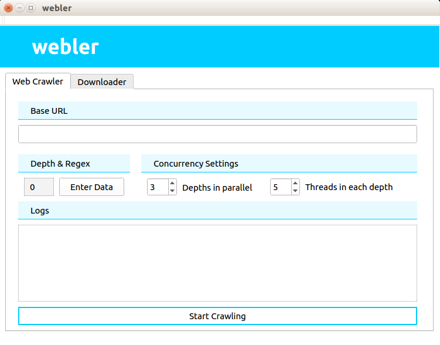
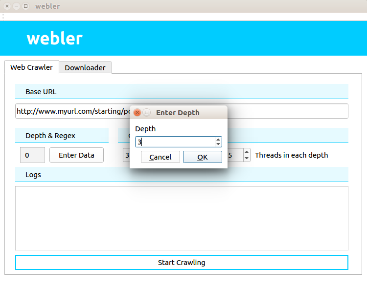
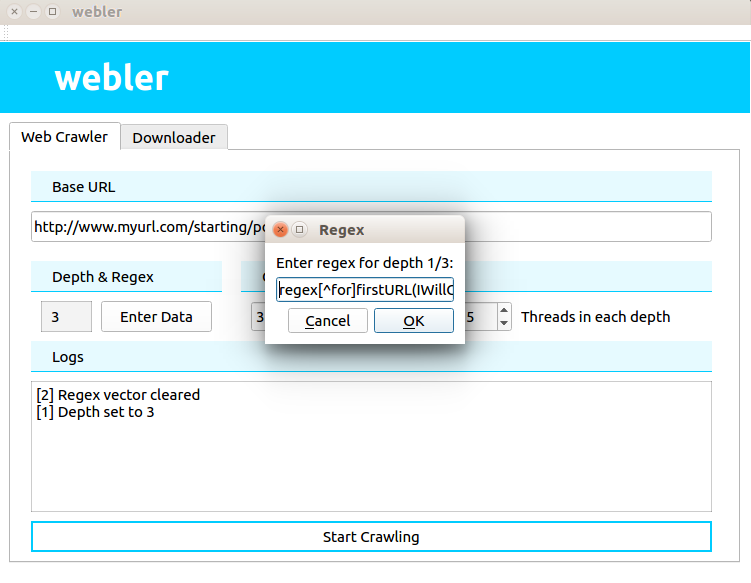

# Desktop app
By using desktop app you will get all the data from the final depth in a file.

Type `webler` in terminal to open the desktop app

> Disclaimer: All the link and regex used below is just for demo and does not actually work. Check our tests for a working data.

#### Enter the stating URL

#### Enter the depth
Click on `Enter Depth` button to enter the depth

#### Enter the regex
After entering the depth, you will be prompted to enter the regex (depth number of regex).

#### Final step

After setting all the data, click on `Start Crawling` and wait till it shows in the logs that crawling is finished.

The data from the final depth will be stored in `$HOME/webler/` directory. You can view the files which are being saved in the terminal while the crawler is in progress.

After the crawler had finished it will display the `ID` in the logs. The files of the corresponding crawling will be stored in `$HOME/webler/$ID/`.

All the GET requests which failed will be stored in `$HOME/webler/$ID/failed_url.txt`

> Warning: Clicking on `Start Crawling` multiple times will start multiple instances of crawling and overload the server and the computer on which it is being run.

Check how to use `WebCrawler` in C++ code [here](https://github.com/thecodesome/libwebler/blob/master/docs/crawler.md)
